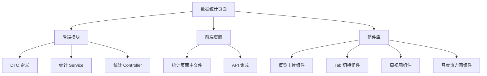
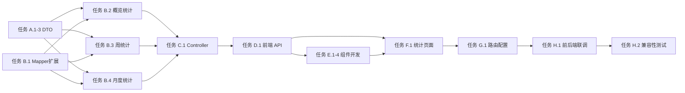

# 功能规划：数据统计页面

**规划时间**：2025-01-13
**预估工作量**：42 任务点

---

## 1. 功能概述

### 1.1 目标
为用户提供直观的睡眠打卡数据可视化页面，帮助用户了解自己的睡眠习惯和坚持情况，增强用户养成规律作息的动力。

### 1.2 范围

**包含**：
- 概览卡片展示（累计天数、连续天数、本月天数）
- 周视图柱状图（最近 7 天打卡趋势）
- 月度热力图（日历网格展示打卡频率）
- Tab 切换交互（周视图/月度热力图）
- 响应式布局适配

**不包含**：
- 数据导出功能
- 社交分享功能
- 历史数据编辑功能
- 睡眠时间分析（仅统计打卡天数）

### 1.3 技术约束
- **前端框架**：UniApp 3.0 + Vue 3.4.21
- **图表库**：使用 uCharts 或自定义 Canvas 实现（避免引入重型图表库）
- **后端框架**：Spring Boot 3.1.5 + MyBatis Plus
- **数据库**：MySQL 8.0（基于现有 check_in 表）
- **跨平台**：兼容小程序、H5、App
- **性能要求**：数据加载时间 < 500ms，图表渲染流畅

---

## 2. WBS 任务分解

### 2.1 分解结构图



### 2.2 任务清单

#### 模块 A：后端 - DTO 定义（3 任务点）

**文件**:
- `backend/src/main/java/com/slema/dto/WeeklyStatsResponse.java`
- `backend/src/main/java/com/slema/dto/MonthlyHeatmapResponse.java`
- `backend/src/main/java/com/slema/dto/OverviewStatsResponse.java`

- [ ] **任务 A.1**：定义概览统计 DTO（1 点）
  - **输入**：业务需求
  - **输出**：`OverviewStatsResponse.java`
  - **关键步骤**：
    1. 创建 `OverviewStatsResponse` 类，包含字段：
       - `totalDays`（累计打卡天数）
       - `currentStreak`（当前连续打卡天数）
       - `monthlyDays`（本月打卡天数）
       - `longestStreak`（最长连续打卡天数，可选）
    2. 使用 Lombok 注解（@Data, @AllArgsConstructor）

- [ ] **任务 A.2**：定义周统计 DTO（1 点）
  - **输入**：周视图需求
  - **输出**：`WeeklyStatsResponse.java`
  - **关键步骤**：
    1. 创建 `WeeklyStatsResponse` 类
    2. 包含字段：
       - `dates`（最近 7 天日期列表，格式 "MM-dd"）
       - `counts`（每日打卡次数列表，0 或 1）
       - `checkInTimes`（每日打卡时间列表，HH:mm，未打卡为 null）

- [ ] **任务 A.3**：定义月度热力图 DTO（1 点）
  - **输入**：热力图需求
  - **输出**：`MonthlyHeatmapResponse.java`
  - **关键步骤**：
    1. 创建 `MonthlyHeatmapResponse` 类
    2. 包含字段：
       - `year`（年份）
       - `month`（月份）
       - `days`（Map<Integer, Boolean>，key 为日期，value 为是否打卡）
       - `totalDays`（当月打卡天数）

---

#### 模块 B：后端 - 统计业务逻辑（10 任务点）

**文件**:
- `backend/src/main/java/com/slema/service/StatsService.java`
- `backend/src/main/java/com/slema/mapper/CheckInMapper.java`（扩展）

- [ ] **任务 B.1**：扩展 CheckInMapper 添加统计查询方法（2 点）
  - **输入**：现有 CheckInMapper
  - **输出**：新增自定义查询方法
  - **关键步骤**：
    1. 在 `CheckInMapper` 中添加方法：
       - `List<CheckIn> findWeeklyCheckIns(@Param("userId") Long userId, @Param("startDate") LocalDate startDate)`
       - `List<CheckIn> findMonthlyCheckIns(@Param("userId") Long userId, @Param("year") int year, @Param("month") int month)`
    2. 创建对应的 XML 映射文件 `CheckInMapper.xml`
    3. 编写 SQL 查询逻辑

- [ ] **任务 B.2**：实现概览统计逻辑（3 点）
  - **输入**：用户 ID
  - **输出**：`OverviewStatsResponse`
  - **关键步骤**：
    1. 在 `StatsService` 中创建方法 `getOverviewStats(Long userId)`
    2. 查询所有打卡记录，计算 `totalDays`
    3. 实现连续打卡天数计算算法：
       - 按日期降序排序
       - 从最新日期开始遍历，遇到中断即停止
       - 返回连续天数
    4. 查询本月打卡记录，计算 `monthlyDays`
    5. 组装 DTO 返回

- [ ] **任务 B.3**：实现周统计逻辑（2 点）
  - **输入**：用户 ID
  - **输出**：`WeeklyStatsResponse`
  - **关键步骤**：
    1. 创建方法 `getWeeklyStats(Long userId)`
    2. 计算最近 7 天日期范围（今天到 6 天前）
    3. 查询该范围内的打卡记录
    4. 构建 7 天的日期数组和打卡状态数组
    5. 提取每日打卡时间（格式化为 HH:mm）

- [ ] **任务 B.4**：实现月度热力图逻辑（3 点）
  - **输入**：用户 ID、年、月
  - **输出**：`MonthlyHeatmapResponse`
  - **关键步骤**：
    1. 创建方法 `getMonthlyHeatmap(Long userId, int year, int month)`
    2. 查询指定月份的所有打卡记录
    3. 构建 Map<Integer, Boolean>，key 为日期（1-31）
    4. 计算当月打卡总天数
    5. 组装 DTO 返回

---

#### 模块 C：后端 - API 接口（3 任务点）

**文件**:
- `backend/src/main/java/com/slema/controller/StatsController.java`

- [ ] **任务 C.1**：创建统计 Controller（3 点）
  - **输入**：StatsService
  - **输出**：3 个 REST API 端点
  - **关键步骤**：
    1. 创建 `@RestController` 类，路径 `/api/stats`
    2. 实现端点 `GET /api/stats/overview/{userId}`：
       - 调用 `statsService.getOverviewStats(userId)`
       - 返回 `ApiResponse<OverviewStatsResponse>`
    3. 实现端点 `GET /api/stats/weekly/{userId}`：
       - 调用 `statsService.getWeeklyStats(userId)`
       - 返回 `ApiResponse<WeeklyStatsResponse>`
    4. 实现端点 `GET /api/stats/monthly/{userId}`：
       - 接收查询参数 `year` 和 `month`（默认当前年月）
       - 调用 `statsService.getMonthlyHeatmap(userId, year, month)`
       - 返回 `ApiResponse<MonthlyHeatmapResponse>`
    5. 添加 `@CrossOrigin` 注解

---

#### 模块 D：前端 - API 集成（2 任务点）

**文件**:
- `frontend/api/index.js`

- [ ] **任务 D.1**：添加统计 API 方法（2 点）
  - **输入**：后端 API 端点
  - **输出**：前端 API 调用方法
  - **关键步骤**：
    1. 在 `api/index.js` 中添加方法：
       ```javascript
       getOverviewStats(userId) {
           return request.get('/stats/overview/' + userId)
       },
       getWeeklyStats(userId) {
           return request.get('/stats/weekly/' + userId)
       },
       getMonthlyStats(userId, year, month) {
           const params = new URLSearchParams()
           if (year) params.append('year', year)
           if (month) params.append('month', month)
           return request.get('/stats/monthly/' + userId + '?' + params.toString())
       }
       ```

---

#### 模块 E：前端 - 组件开发（15 任务点）

**文件**:
- `frontend/components/OverviewCard.vue`
- `frontend/components/TabBar.vue`
- `frontend/components/WeeklyView.vue`
- `frontend/components/MonthlyHeatmapView.vue`

- [ ] **任务 E.1**：创建概览卡片组件（3 点）
  - **输入**：概览统计数据
  - **输出**：`OverviewCard.vue`
  - **关键步骤**：
    1. 创建组件，接收 props：`totalDays`, `currentStreak`, `monthlyDays`
    2. 使用 grid 布局展示 3 个统计项
    3. 每个统计项包含：
       - 数字大字显示（颜色：#667eea）
       - 标签文字（如"累计睡觉"）
       - 可选：添加图标装饰
    4. 添加加载状态和空状态处理
    5. 编写单元测试（可选）

- [ ] **任务 E.2**：创建 Tab 切换组件（2 点）
  - **输入**：无
  - **输出**：`TabBar.vue`
  - **关键步骤**：
    1. 创建组件，定义 tabs：`['周视图', '月度热力图']`
    2. 使用 emits 向父组件传递当前选中的 tab
    3. 样式设计：
       - 选中状态：底部高亮边框，文字颜色 #667eea
       - 未选中：灰色文字
       - 平滑过渡动画
    4. 支持动态切换内容区域

- [ ] **任务 E.3**：创建周视图组件（5 点）
  - **输入**：周统计数据
  - **输出**：`WeeklyView.vue`
  - **关键步骤**：
    1. 创建组件，接收 props：`dates`, `counts`, `checkInTimes`
    2. 实现柱状图渲染：
       - 使用 Canvas 或 uni-app 的 `view` + 样式实现
       - Y 轴：0-1（是否打卡）
       - X 轴：7 天日期
       - 柱状图颜色：打卡为 #667eea，未打卡为 #e0e0e0
       - 高度：打卡占满高度，未打卡为 10% 提示条
    3. 添加交互：
       - 点击柱子显示打卡时间（tooltip）
       - 今日高亮显示
    4. 添加日期标签（MM-dd 格式）
    5. 处理空数据情况

- [ ] **任务 E.4**：创建月度热力图组件（5 点）
  - **输入**：月度热力图数据
  - **输出**：`MonthlyHeatmapView.vue`
  - **关键步骤**：
    1. 创建组件，接收 props：`year`, `month`, `days`
    2. 实现日历网格布局：
       - 使用 CSS Grid 7 列（代表一周 7 天）
       - 每个格子显示日期数字（1-31）
       - 第一行显示"一二三四五六日"作为星期表头
    3. 热力图颜色设计：
       - 已打卡：深紫色 #667eea
       - 未打卡：浅灰色 #f0f0f0
       - 未来日期：白色或浅色边框
       - 今日：特殊边框高亮
    4. 添加交互：
       - 点击日期显示详情（打卡时间/未打卡提示）
       - 长按显示更多信息（可选）
    5. 实现月份切换：
       - 上月/下月按钮
       - 触发父组件重新加载数据
    6. 显示当月统计（"本月已打卡 X 天"）

---

#### 模块 F：前端 - 统计页面主文件（5 任务点）

**文件**:
- `frontend/pages/stats/stats.vue`

- [ ] **任务 F.1**：创建统计页面（5 点）
  - **输入**：所有子组件
  - **输出**：完整的统计页面
  - **关键步骤**：
    1. 创建 `pages/stats/stats.vue`
    2. 页面结构：
       ```html
       <view class="stats-page">
         <OverviewCard :total-days="overview.totalDays" ... />
         <TabBar @change="handleTabChange" />
         <WeeklyView v-if="activeTab === 'weekly'" ... />
         <MonthlyHeatmapView v-else ... />
       </view>
       ```
    3. 实现数据加载逻辑：
       - `onMounted` 时调用 API 加载概览、周数据、月数据
       - 显示 loading 状态
       - 错误处理和重试机制
    4. 实现下拉刷新：
       - 使用 `uni.startPullDownRefresh`
       - 重新加载所有数据
    5. 实现月份切换逻辑（月度热力图）
    6. 页面样式：渐变背景、卡片阴影、圆角设计

---

#### 模块 G：前端 - 路由配置（1 任务点）

**文件**:
- `frontend/pages.json`

- [ ] **任务 G.1**：添加统计页面路由（1 点）
  - **输入**：stats.vue
  - **输出**：更新后的 pages.json
  - **关键步骤**：
    1. 在 `pages.json` 中添加页面配置：
       ```json
       {
         "path": "pages/stats/stats",
         "style": {
           "navigationBarTitleText": "数据统计"
         }
       }
       ```
    2. 在 `tabBar.list` 中添加入口：
       ```json
       {
         "pagePath": "pages/stats/stats",
         "text": "统计",
         "iconPath": "static/icons/stats.png",
         "selectedIconPath": "static/icons/stats-active.png"
       }
       ```
    3. 准备图标资源（可选，暂时使用文字）

---

#### 模块 H：集成与测试（3 任务点）

- [ ] **任务 H.1**：前后端联调（2 点）
  - **输入**：完成的前后端代码
  - **输出**：可用的统计功能
  - **关键步骤**：
    1. 启动后端服务，测试所有 API 端点
    2. 使用 Postman 或 curl 验证返回数据格式
    3. 前端对接后端，调试数据加载
    4. 修复跨域、数据格式等问题

- [ ] **任务 H.2**：跨平台兼容性测试（1 点）
  - **输入**：完成的统计页面
  - **输出**：兼容性问题修复
  - **关键步骤**：
    1. 在微信开发者工具中测试小程序版本
    2. 在浏览器中测试 H5 版本
    3. 检查 Canvas/图表在不同平台的渲染效果
    4. 修复平台兼容性问题（如样式差异）

---

## 3. 依赖关系

### 3.1 依赖图



### 3.2 依赖说明

| 任务 | 依赖于 | 原因 |
|------|--------|------|
| B.2 概览统计 | A.1 DTO | 需要 DTO 定义作为返回类型 |
| B.3 周统计 | A.2 DTO | 需要 DTO 定义作为返回类型 |
| B.4 月度统计 | A.3 DTO | 需要 DTO 定义作为返回类型 |
| B.2-B.4 | B.1 Mapper扩展 | 需要数据库查询方法 |
| C.1 Controller | B.2-B.4 | 需要业务逻辑完成 |
| D.1 前端 API | C.1 | 需要后端 API 端点确定 |
| E.1-E.4 组件 | D.1 | 需要 API 方法调用数据 |
| F.1 统计页面 | E.1-E.4 | 需要子组件完成 |
| H.1 联调 | F.1, G.1 | 需要页面和路由完成 |

### 3.3 并行任务

以下任务可以并行开发：
- **阶段 1**：A.1, A.2, A.3（DTO 定义可同时进行）
- **阶段 2**：E.2（TabBar 组件独立，可提前开发）
- **阶段 3**：E.1（概览卡片）∥ E.3（周视图）∥ E.4（月度热力图）
- **阶段 4**：C.1（Controller）和 D.1（前端 API）可同步进行

---

## 4. 实施建议

### 4.1 技术选型

| 需求 | 推荐方案 | 理由 |
|------|----------|------|
| 周视图柱状图 | Canvas + 自定义绘制 | UniApp 跨平台兼容性好，无需引入重型库 |
| 月度热力图 | CSS Grid + 动态绑定 | 响应式布局，易于维护 |
| 连续天数计算 | Java Stream + 排序算法 | 后端计算性能更好，减少前端负担 |
| 日期格式化 | Java DateTimeFormatter | 统一格式，避免时区问题 |
| 错误处理 | UniApp uni.showToast | 用户友好的提示 |

### 4.2 潜在风险

| 风险 | 影响 | 缓解措施 |
|------|------|----------|
| 连续天数计算逻辑复杂 | 中 | 编写单元测试，覆盖边界情况（跨年、跨月） |
| Canvas 在小程序兼容性 | 中 | 提前在真机测试，准备降级方案（使用 view 替代） |
| 月度热力图闰年/大小月处理 | 低 | 使用 Java LocalDate 自动处理 |
| 数据量大时查询性能 | 低 | 添加数据库索引 (user_id, date) |
| API 跨域问题 | 低 | 后端已配置 @CrossOrigin，确保配置正确 |

### 4.3 测试策略

#### 单元测试
- **StatsService**：测试连续天数计算、边界情况（空数据、单条数据）
- **CheckInMapper**：测试 SQL 查询结果正确性
- **OverviewCard**：测试 props 传入后的渲染结果

#### 集成测试
- 测试 API 端点返回正确的 JSON 格式
- 测试前端 API 调用成功/失败场景
- 测试月份切换时数据重新加载

#### E2E 测试
- 用户打开统计页面 → 查看概览数据
- 切换到周视图 → 查看柱状图
- 切换到月度热力图 → 切换月份 → 查看不同月份数据
- 下拉刷新 → 验证数据更新

---

## 5. 验收标准

功能完成需满足以下条件：

### 功能验收
- [ ] 概览卡片正确显示累计天数、连续天数、本月天数
- [ ] 周视图显示最近 7 天打卡趋势，今日高亮
- [ ] 月度热力图正确显示当月打卡状态，支持月份切换
- [ ] Tab 切换流畅，无卡顿
- [ ] 下拉刷新功能正常
- [ ] 数据为空时显示友好提示

### 性能验收
- [ ] API 响应时间 < 500ms
- [ ] 页面加载时间 < 1s
- [ ] 图表渲染流畅，无掉帧

### 兼容性验收
- [ ] 微信小程序正常运行
- [ ] H5 浏览器正常运行
- [ ] 不同屏幕尺寸适配正常

### 代码质量验收
- [ ] 代码通过 ESLint 检查（前端）
- [ ] 代码通过 Checkstyle 检查（后端）
- [ ] 核心业务逻辑有单元测试覆盖
- [ ] 无高优先级 Bug
- [ ] Git 提交信息规范

---

## 6. 数据库优化建议

为了提升统计查询性能，建议添加索引：

```sql
-- 优化用户按日期查询打卡记录
ALTER TABLE check_in ADD INDEX idx_user_date (user_id, date);

-- 优化查询用户所有打卡记录
ALTER TABLE check_in ADD INDEX idx_user_id (user_id);
```

---

## 7. 后续优化方向（Phase 2）

Phase 2 可考虑的增强功能：
- **睡眠时间分析**：统计平均打卡时间、早睡/晚睡分布
- **成就系统**：连续打卡 7 天、30 天勋章
- **数据对比**：与上月/上周数据对比，显示趋势箭头
- **数据导出**：支持导出 CSV、Excel 格式
- **社交分享**：生成打卡海报分享到朋友圈
- **年度报告**：类似网易云音乐的年度睡眠报告
- **目标设定**：设定每月打卡目标，显示进度条
- **提醒优化**：根据历史数据预测最佳提醒时间

---

## 8. 附录：关键代码示例

### 8.1 连续天数计算算法（Java）

```java
public int calculateCurrentStreak(List<CheckIn> checkIns) {
    if (checkIns.isEmpty()) {
        return 0;
    }

    // 按日期降序排序
    checkIns.sort((a, b) -> b.getDate().compareTo(a.getDate()));

    LocalDate today = LocalDate.now();
    int streak = 0;
    LocalDate expectedDate = today;

    for (CheckIn checkIn : checkIns) {
        if (checkIn.getDate().equals(expectedDate)) {
            streak++;
            expectedDate = expectedDate.minusDays(1);
        } else if (checkIn.getDate().isBefore(expectedDate.minusDays(1))) {
            // 遇到中断，停止计算
            break;
        }
    }

    return streak;
}
```

### 8.2 周视图柱状图（Vue Template 示例）

```vue
<template>
  <view class="weekly-view">
    <view class="chart-container">
      <view
        v-for="(day, index) in days"
        :key="index"
        class="bar-item"
        :class="{ active: day.hasCheckedIn, today: day.isToday }"
        @click="showDetail(day)"
      >
        <view class="bar" :style="{ height: day.hasCheckedIn ? '100%' : '10%' }"></view>
        <text class="date-label">{{ day.date }}</text>
      </view>
    </view>
  </view>
</template>
```

---

**文档结束**
